# JAVA_Setup
**This is JAVA_Beginner tutrial manual**    
***Windowsユーザに向けた内容になります***  
Javaの初心者がコードを書く環境を整えて実際にプログラミングを走らせる(=動かせる)状況を作り出すための事前準備から、実際に簡単なコードを記述してコンソール画面(=PC画面)に何かを表示するところまでを目標としています。  
***最初に言っておきますが、分からないことがあったらすぐに先輩に聞きましょう。聞かれた方も知識の整理整頓ができるので、嫌な気持ちにはなりません***<br>
***また、会社やグループなどでこのページとの相違点があった場合は絶対に会社に合わせてください。コードスタイルを含めて自分の所属するところそれぞれに正解があります***<br>
--------------------------------------------<br>
駆け込み寺 : ren.06071997@gmail.com<br>
(LINEを知っているならそちら推奨)<br>
--------------------------------------------<br>
### ちなみにプロの方には到底お見せできないほどにチープ(ファイルアクセスがガバガバだったり、如何にも素人くさい)なので、あまり外部公開はしないように！！（
~~というかそもそもReadmeファイルに記述している時点でお察し感すごい~~
# [参照外部リンク](https://codeaid.jp/eclipse-java/)
丸投げで申し訳ないが、基本的な点については上記リンクを参照して、EclipseのAll in one Packageをインストールして環境の構築を行って下さい    
## [外部リンク](https://techacademy.jp/magazine/8998)  
JDKやPathの設定(環境変数)、テキストエディタといった単語の意味を既に理解している優秀な方は  
1つ↑リンクを参考に設定すると~~他の人にマウントを取れます~~  
本ページでは、主に参照外部リンク内での補足や訂正になります。
インストールまで終了し、Eclipseを起動したところから解説を始めます。  
まずworkspaceに関しては、名前はそのままで大丈夫です。皆がworkspaceで作業しているので、多数に合わせましょう  
基本設定に関してですが、初期設定のままで大丈夫なので、流し読みで大丈夫です。  
インデント、タブ、スペースなどの設定に関してはリンク先でも触れられていますが会社によって異なりますので、  
(これをコードスタイルと呼びます。)  
取り敢えず初期設定にしつつどこで設定できるのか程度は覚えておくと安心です。  
## プロジェクトの作成
プロジェクトの作成については、こちらでレクチャーします。  
下記画像のように、ファイル→新規→Javaプロジェクトを選択  
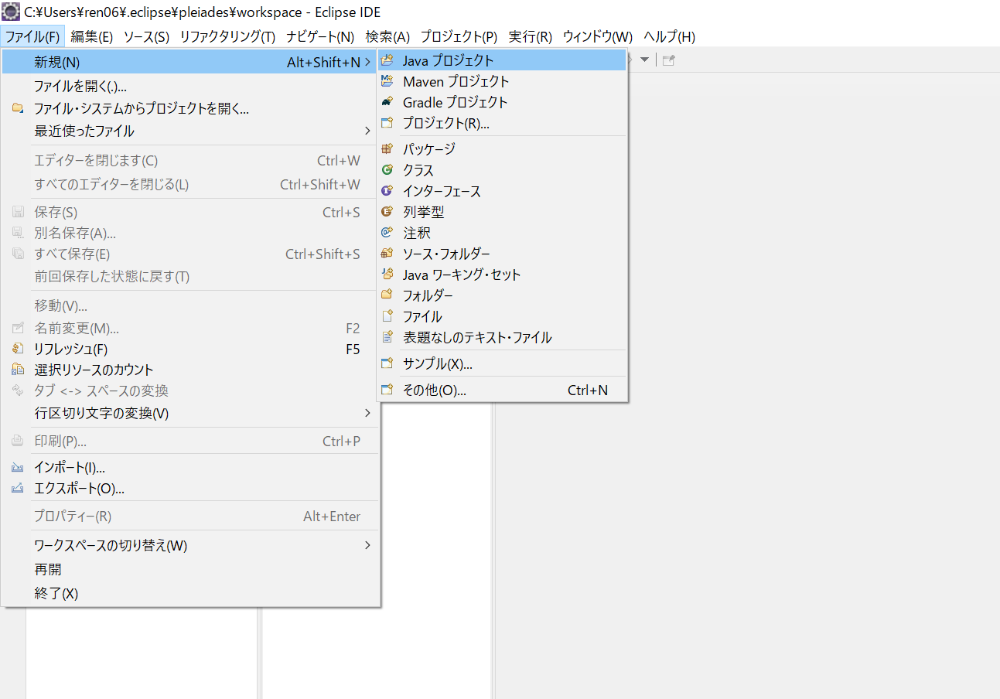
今回は、Project_testというプロジェクト名にしました。そのまま完了を押すとmodule-info.javaファイルを作成するかどうか聞いてきます。  
作成しないを選択して、進めましょう(上記ファイルは他の人がコードを見なくても何をしているか分かるような情報を記入するファイルです)  
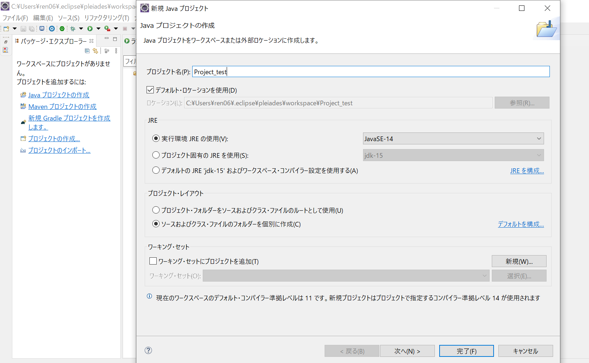
次に、作成されたProject_testの2つ下に「src」というフォルダがあるので、そちらを右クリックして、下記画像のようにパッケージを新規作成<br>
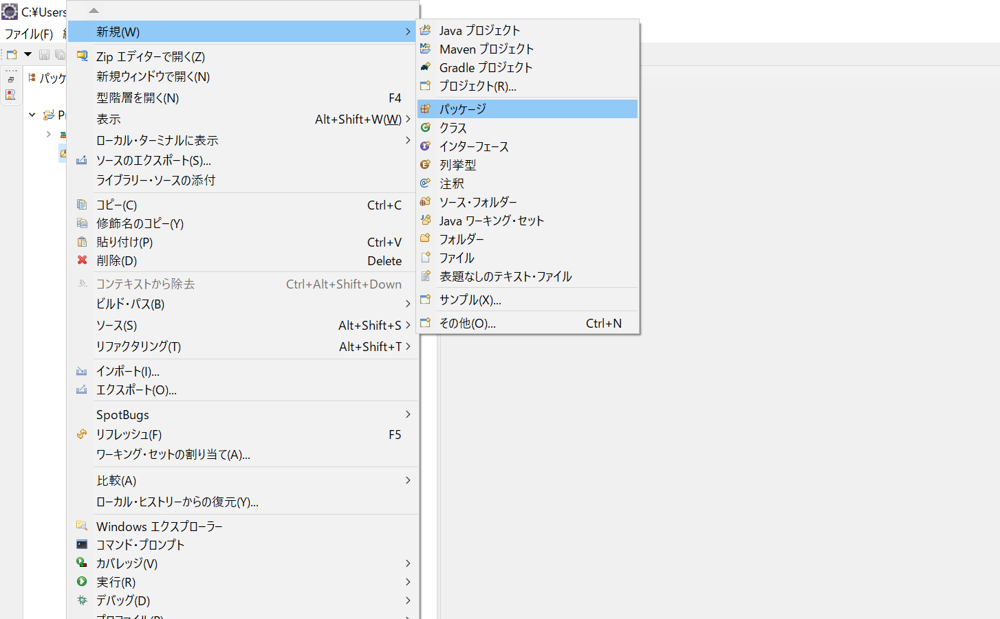
パッケージ名に関してもなんでもよいですが、package_testとでもしておきましょう。<br>
また、赤丸で囲ったところのチェックボックスを外しておいてください<br>
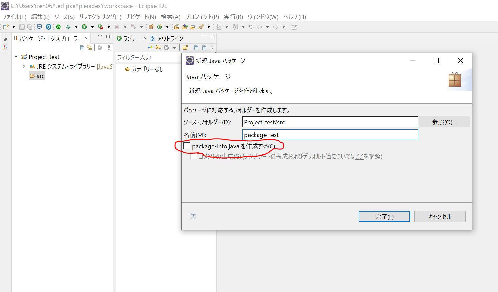
ここまでが大枠の作成になります。要するに、後から見返しても分かりやすくなるように初めから整理整頓しておきましょうというお話です。<br>
~~昔みたいにおもちゃ箱に全てを詰め込むのはやめましょう~~<br>
最後に、コードを実際に書き込んでいくclassの作成です。要はパソコンさんにお仕事を命令する箇所になります。
下記画像のように作成したパッケージを右クリックからのクラスファイルの作成。<br>
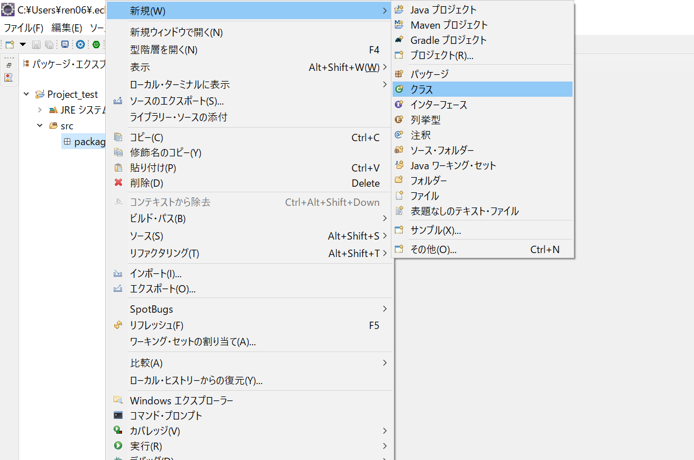
今回はHello World!!と表示させるので、画像のようなクラスファイルにでもしておきましょう。
ついでに、public static void main()みたいなやつのチェックマークを付けておいてください。
これは最初に書かなければならない面倒なおまじないをあらかじめ書いておいてくれるありがたい機能です。
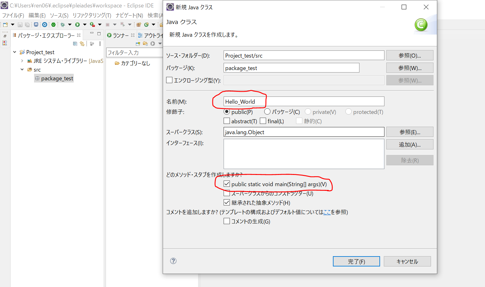
すると、下記のような画面が出現すると思います。
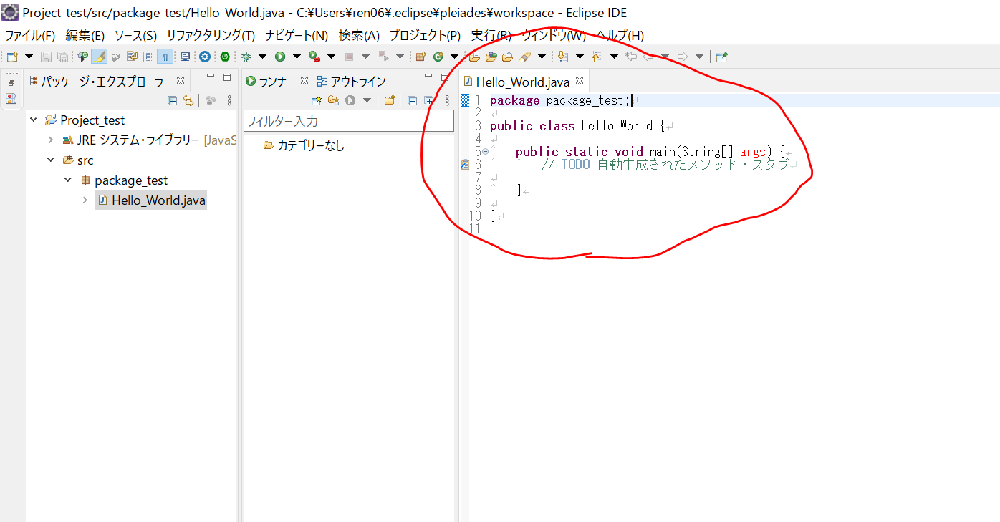
出現したら、本ページ下行のようにコードを追加してください。
***この際の注意点として、System.out.println();の前はスペースではなく、Tabキーを押すようにして下さい***<br>
上記タブのことを、「インデント」と呼んだりします。<br>
最近エンジニアの間では、タブの空白を2に設定したりする場合もあるようですが、それこそ「社内ルール」に従っていれば問題ありません。<br>

```
package package_test;

public class Hello_World {

	public static void main(String[] args) {
		// TODO 自動生成されたメソッド・スタブ
		System.out.println("Hello World!!");
		
	}

}
```
下記画像の赤枠で囲った青い部分がタブになります。<br>
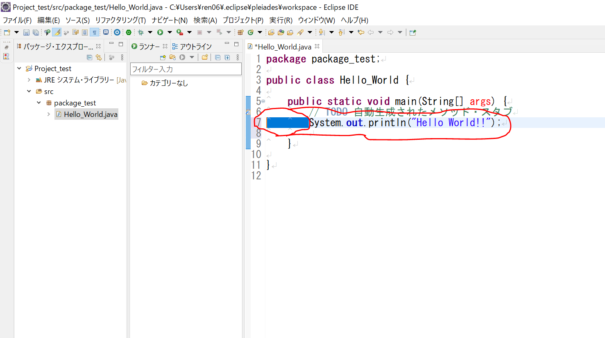
お待たせしました。ついに実行のフェーズに移ります。<br>
残念ながらここからもうひと手間かかります！最初のセットアップみたいなものなので、頑張りましょう<br>
下記画像のように、緑色の再生ボタンみたいなマーク(実行ボタンです)の隣にある黒い下向き▼を押下して、実行の構成を選択<br>
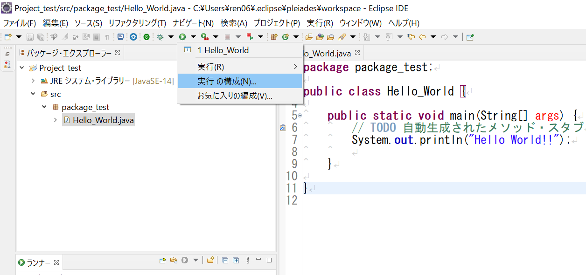
Javaアプリケーションをダブルクリックして、実行ボタンがあるので、そのまま実行してやりましょう。<br>
その際に保存するファイルの選択みたいな画面が出てきたら、そのまま「OK」を押してもらって大丈夫です。<br>
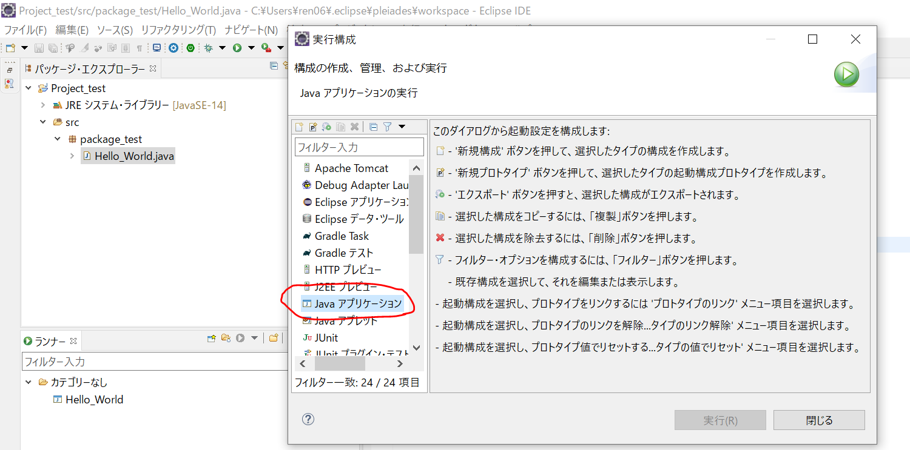
お疲れ様でした！おそらく以下のような画面になっているかと思います。これにて表示までの簡単なプログラム作成は終了です<br>
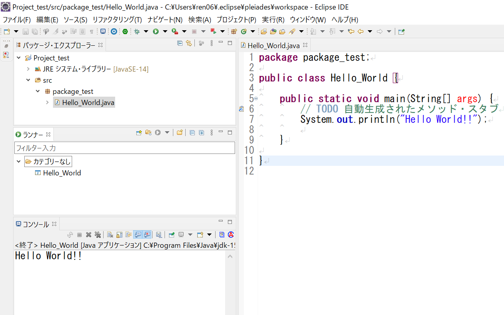
これだけ頑張ってこんな程度！？と思ったそこのアナタ<br>
そうなんです。こんな程度を沢山組み合わせて世の中のJAVAで作られたアプリケーションは動いています。<br>
日頃からもっと作成者に感謝して使うようにしましょう。もし簡単なアプリケーションを作りたくなるようなモチベになったら、駆け込み寺までどうぞ。<br>
プログラミングの世界へ「Hello World!!」<br>
